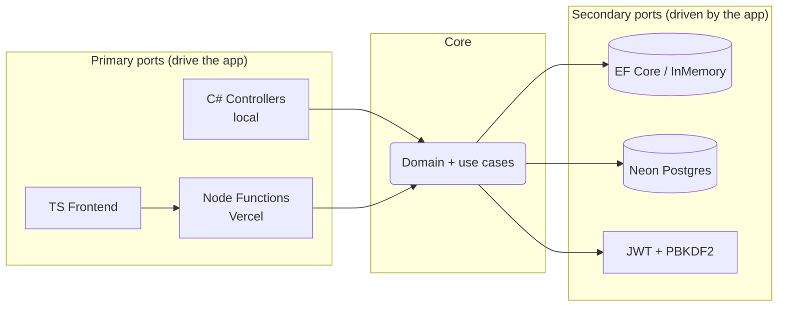
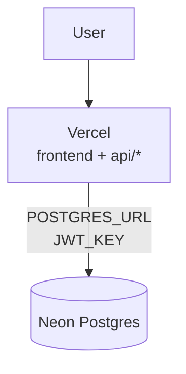

<div align="center">

# 🎮 DigitalGaming

**Dominican gaming store — consoles, videogames, PC, monitors & accessories.**

[](https://dotnet.microsoft.com/)
[](https://www.typescriptlang.org/)
[](https://nodejs.org/)
[](https://neon.tech/)
[](https://vercel.com/)

Prices in **RD$** · Shipping across the country · GTA VI preorder with countdown

</div>

---

## ✨ Features

- 🛍️ Paginated catalog (offset/limit) with CDN cache, filters and **tolerant search** (forgiving with accents: `audifono` → *Audífono*)
- 🛒 Cart with **live stock**, shipping zones (SD / Interior / pickup) and checkout with login
- 🔐 Auth with short JWT (15 min) + **rotating refresh tokens**, rate limiting and logout everywhere
- 📦 Order history + **WhatsApp** confirmation
- 🛠️ Hidden admin mode (10 taps on the title): create/edit/delete, hidden products, image upload to Storage
- 🎬 **GTA VI** preorder banner with countdown to Nov 19, 2026

## 🧱 Stack

| Layer | Technology |
|---|---|
| Frontend | HTML + layered CSS (`@layer`) + TypeScript compiled with `tsc` |
| Production API | Vercel Node Functions + TS (`pg`, `jsonwebtoken`, `@vercel/blob`, `formidable`) |
| Local/dev API | ASP.NET Core 10 + C# (same contracts) |
| Data | Neon Postgres (EF Core + migrations) or in-memory locally |
| Images | Vercel Blob (local base64 as fallback) |
| Deploy | Vercel (frontend + functions). C# is **not** deployed: local lab only |

## 🏛️ Architecture

**Strict layers** in all 3 languages (`Core → Application → Infrastructure → Api`, `domain → data → services → ui`, `base → layout → components → pages → themes`) and **light hexagonal**: the domain knows neither EF nor `pg`; repositories are adapters swapped via environment variable.





## 📁 Structure (what each thing is)

```
├── api/                  🚀 PRODUCTION — Node+TS Functions (Vercel). The only thing running in the cloud.
├── wwwroot/              🖥️ Shared frontend (served by both Vercel and local C#).
│   ├── ts/               Real source (compiled with tsc, never edit js by hand)
│   └── js/               Generated (git-ignored, except config.js)
├── db/                   schema.sql + seed.sql for Neon (SQL Editor)
├── server-dotnet/        🧪 LOCAL — C# API for developing/testing (dotnet run).
│                         NOT deployed. Generates migrations (dotnet-ef).
├── scripts/              Vercel build (generates js/config.js from API_URL)
├── vercel.json           Static deploy + immutable headers
└── package.json          Node deps + npm scripts
```

> **Golden rule**: `api/` = real production · `server-dotnet/` = local lab. Same routes, same rules.

## 🚀 Quickstart (local)

Requirements: [.NET 10 SDK](https://dotnet.microsoft.com/download) and [Node 22+](https://nodejs.org/).

```powershell
# 1. Frontend (once, or npx tsc --watch while developing)
npm install
npm run build

# 2. API + store (in-memory data)
dotnet run --project server-dotnet/DigitalGaming.csproj
# → http://localhost:5127
```

- Demo account: `admin` / `Admin1234` · Admin: 10 taps on the title.
- With `ConnectionStrings__DefaultConnection` it uses Postgres instead of memory.

## ☁️ Deploy (Vercel + Neon)

1. Neon → SQL Editor → run `db/schema.sql` and `db/seed.sql`.
2. Vercel → import the repo with env vars:

| Variable | Value |
|---|---|
| `POSTGRES_URL` | Neon pooled string (`?sslmode=require`) |
| `JWT_KEY` | 64+ char key (new, not the dev one) |
| `API_URL` | *(empty = same origin)* |
| Blob | Storage tab → create a Blob store and connect it |

3. Deploy. Verify `/api/products` and create an account.

## 🧪 Verification

```powershell
npm run typecheck        # strict tsc, web + api
node --import tsx/esm <test>.mjs   # harnesses (requires npm install)
dotnet build server-dotnet/DigitalGaming.csproj
```

## 🗺️ Roadmap

- [ ] Roles (real `admin` on writes)
- [ ] Payments (Azul/CardNet) + order states
- [ ] Tests in the repo (xUnit + Playwright)
- [ ] Multi-image gallery, wishlist, coupons
- [ ] SEO + sitemap + PWA
